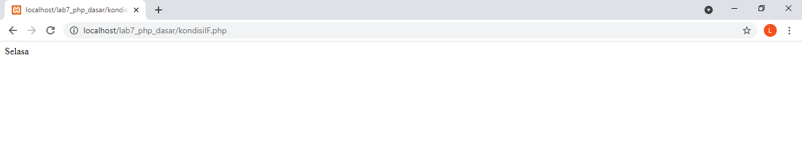

# Langkah - Langkah Pratikum

## Aplikasi yang di butuhkan
- XAMPP
- Teks editor disini saya menggunkan sublime text editor
- Google chrome

### Menjalankan Web Server

Untuk menjalankan web server dari menu XAMPP Control.

### Memulai php
Buat folder lab7_php_dasar pada root directory web server (d:\xampp\htdocs)

Kemudian untuk mengakses direktory tersebut pada web server dengan mengakses URL:
http://localhost/lab7_php_dasar/

### Membuat PHP Dasar
Buat file baru dengan nama php_dasar.php

Kemudian untuk mengakses hasilnya melalui URL:
http://localhost/lab7_php_dasar/php_dasar.php

### Membuat Variable PHP
Menambahkan variable pada program.

input

### Membuat Predefine Variable $_GET
input

output

### Membuat Form Input
input

output

### Membuat Operator
input

output

### Membuat Kondisi IF
input

output

### Membuat Kondisi Switch
input

output

### Membuat Perulangan for
input

output

### Membuat Perulangan while
input

output

### Membuat Perulangan dowhile
input

output

### Pertanyaan dan Tugas
Buatlah program PHP sederhana dengan menggunakan form input yang menampilkan
nama, tanggal lahir dan pekerjaan. Kemudian tampilkan outputnya dengan menghitung
umur berdasarkan inputan tanggal lahir. Dan pilihan pekerjaan dengan gaji yang
berbeda-beda sesuai pilihan pekerjaan.

input

output

Sekian Dan Terima Kasih

